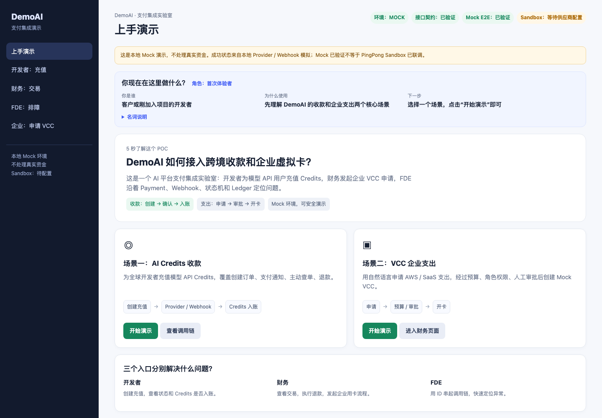
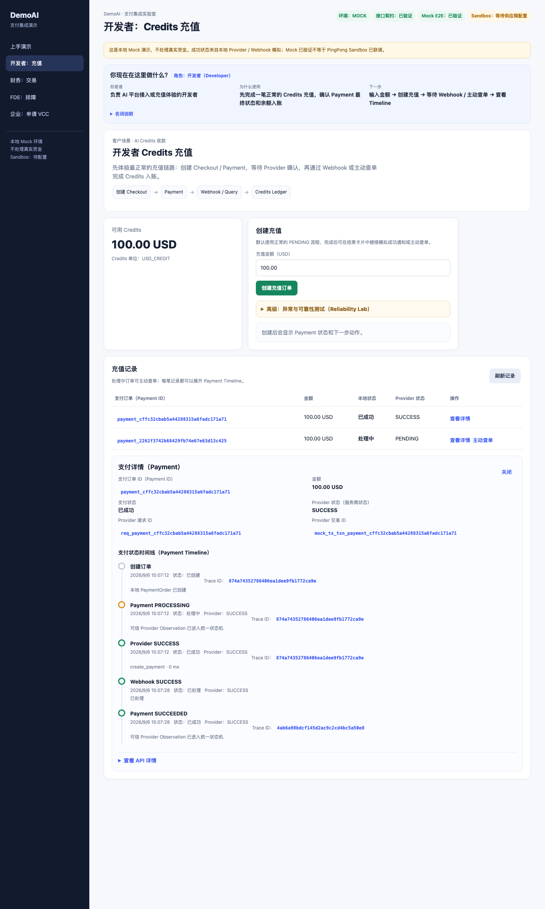
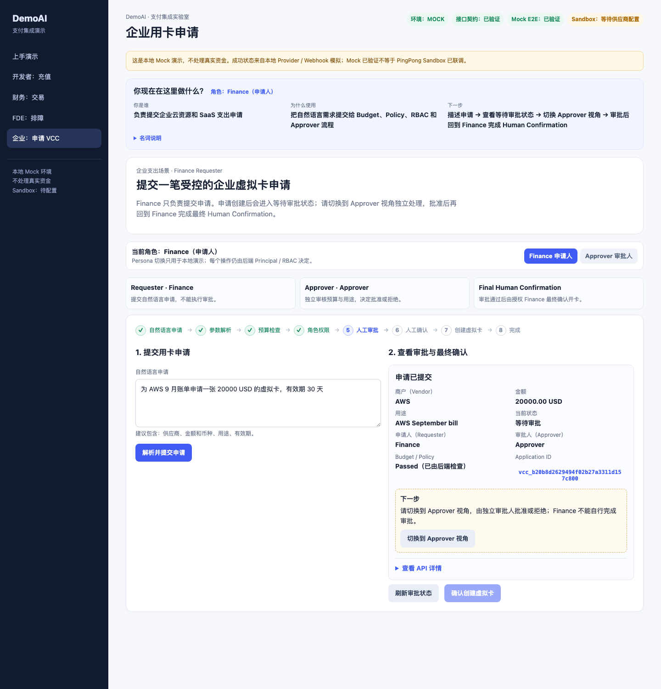

# DemoAI Global Payments & VCC Integration POC

[](https://github.com/jonji886/pingpong-checkout-vcc-integration-poc/actions/workflows/ci.yml)

> 面向 AI 平台客户的跨境收款与企业虚拟卡集成验证，覆盖开发者 Credits 充值、企业 SaaS / 云资源支出及支付异常恢复。

本项目服务于 AI Platform Developer、Finance、Approver、FDE 和 Solution Architect 的方案评审与演示。它基于 PingPong 公开资料和虚构客户 DemoAI 场景构建，不是 PingPong 官方项目，也不代表真实客户案例或真实 Sandbox 联调。

## 本 POC 验证了什么

- Checkout Create → Webhook / Query → Credits 入账完整链路。
- Create Timeout / 429 / Duplicate Webhook 下不产生重复资金效果。
- Webhook 验签、金额/币种校验、Payment 状态机和幂等 Credits Ledger。
- AI / Deterministic VCC Request → Budget → Policy / RBAC → Approval → Human Confirmation。
- Trace ID 串联 API、Provider、Webhook、Ledger 和 Audit，支持 FDE 排障。
- 当前证据为 `Contract Verified` + `Mock E2E Verified`；真实 PingPong Sandbox 保持 `Sandbox Pending`。

## 两条核心业务链路

### Developer Credits 收款

```text
Developer → Create Checkout / Payment → Provider
          → Verified Webhook 或 Query / Reconciliation
          → Payment State Machine → Exactly-once Credit Ledger
```

### Enterprise VCC 支出

```text
Finance Requester → Structured Parsing → Budget / Policy / RBAC
                 → Approver → Finance Human Confirmation → Mock VCC
```

VCC 页面明确分开 `Finance（Requester）`、`Approver` 和 `Final Human Confirmation` 三个职责；Persona 切换仅用于本地演示，审批和开卡仍由后端 Bearer token 与 RBAC 控制。

## 真实 UI 截图

以下截图来自当前 Mock UI，使用方式与仓库代码保持一致：



Guided Demo 首页：客户先看到收款与企业支出的两个业务入口。



Payment Timeline 与 Failure Recovery：展示状态、Provider 调用、Webhook、主动查单和 Ledger 关联。



VCC Workflow 与角色切换：Finance 提交后切换到 Approver 审批，再回到 Finance 做最终确认。

> 截图只用于说明当前页面，不是营销稿；如果页面文案或布局变化，应重新运行本地 Mock 后更新 `docs/assets/` 中对应文件。

## Key Engineering Decisions

| 风险 / 问题 | 设计决策 | POC 如何证明 |
| --- | --- | --- |
| Create Timeout，结果未知 | 不立即重新创建，保留原 `partner_transaction_id` / `provider_request_id` 并主动 Query | `TIMEOUT` / Recovery 场景保持 `PROCESSING` |
| Webhook 重复 | Delivery 去重 + Credits Ledger 数据库唯一约束 | 重复发送 SUCCESS 不重复入账 |
| Webhook 乱序 | Domain State Machine 控制合法、单调状态迁移 | Out-of-order 测试与状态机单测 |
| Webhook 丢失 | Reconciliation 主动查单恢复 | Query / 后台对账接口 |
| Refund 状态不确定 | `CreditHold` → settle / release | Refund Failure Flow 与重复退款测试 |
| LLM 幻觉或越权 | LLM 只负责结构化解析；预算、Policy、RBAC、审批和 Human Confirmation 由确定性代码执行 | VCC Workflow、越权返回 403、Audit |

## Evidence Status

| Capability | Contract | Mock E2E | Sandbox |
| --- | --- | --- | --- |
| Checkout Create / Session | ✅ | ✅ | ⏳ Provider Provisioning |
| Checkout Query / Refund | ✅ | ✅ | ⏳ Provider Provisioning |
| Checkout Webhook | ✅ | ✅ | ⏳ Local Simulation |
| VCC Create Card / Query / Action | ✅ | ✅ | ⏳ Provider Provisioning |

`Contract Verified` 表示公开字段已通过 DTO / Mapper / fixture / MockTransport 检查；`Mock E2E Verified` 表示本地 Provider、Webhook、Ledger、VCC Workflow 和自动化测试已验证。二者都不等同于真实 Sandbox。当前 Sandbox 需要合法账户、凭证、签名密钥、产品权限和 callback 条件，因此保持 `Sandbox Pending`。

## 快速运行（Mock）

环境要求：Python 3.10+。

```bash
cp .env.example .env
uv sync --extra test
python3 scripts/migrate.py
python3 -m uvicorn app.main:app --reload
```

启动后访问：

- `/ui/demo`：Guided Demo 首页。
- `/ui/developer`：默认 Happy Path 的 Credits 充值；高级 Reliability Lab 包含 Provider / Webhook 异常场景。
- `/ui/vcc`：Finance / Approver Persona、审批和最终 Human Confirmation。
- `/ui/finance`：交易、退款与 Mock 失败实验室。
- `/ui/fde`：按 Payment ID、Application ID 或 Trace ID 排查调用链。
- `/docs`：Swagger API 文档。

## 推荐演示路径

### 1. Happy Path：先展示业务价值

1. 打开 `/ui/developer`，保持默认 `100.00 USD`，点击“创建充值订单”。
2. 在结果卡片中展开“高级：异常与可靠性测试”，发送 `SUCCESS` Webhook；也可以使用“主动查单”。
3. 查看 Payment 状态为 `SUCCEEDED`，Credits 通过 Ledger 增加一次，再打开 Payment Timeline。

### 2. Reliability Lab：再展示恢复能力

在 Developer 页面高级区域选择 `TIMEOUT`、`429`、Provider Reject 或 Manual Review。创建结果未知时保持 `PROCESSING`，使用 Query / Reconciliation，不创建第二笔 Payment。对处理中订单可验证重复 Webhook、无效签名、金额不匹配、未知订单和非法状态。

### 3. VCC：展示职责分离

1. 以 Finance 视角提交“为 AWS 9 月账单申请一张 20000 USD 的虚拟卡，有效期 30 天”。
2. 确认页面显示“申请已提交 / 等待审批 / 申请人 Finance / 审批人 Approver”。
3. 切换到 Approver 视角，加载 Application ID，核对商户、金额、用途、Budget、Policy 和申请人，再批准或拒绝。
4. 批准后切回 Finance，执行最终 Human Confirmation，创建脱敏的 Mock VCC。

## 本地演示身份

以下 Token 只用于本地 Mock，已经在浏览器 UI、测试和示例配置中公开，绝不能复用到任何真实环境：

| Token | Persona | 用途 |
| --- | --- | --- |
| `dev-token` | Developer | 本人充值、余额和 Payment |
| `finance-token` | Finance | 交易、退款、VCC 申请和最终开卡 |
| `approver-token` | Approver | VCC 批准 / 拒绝 |
| `admin-token` / `fde-token` | FDE / Admin | Debug、Webhook、对账和 Mock 场景 |

## Sandbox 边界

必须显式设置 `PINGPONG_MODE=mock|sandbox`，不会从 Sandbox 静默降级到 Mock。当前 Sandbox Adapter 仅按仓库记录的公开 Unified Checkout / Issuing contract 建模，实际账户产品、签名 canonicalization、callback 和权限仍需以 PingPong 当前官方文档与账户契约为准。没有真实外部调用证据时，本项目只声明 `Contract Verified`、`Mock E2E Verified` 和 `Sandbox Pending`。

项目不处理真实资金，不采集或发送 PAN/CVV，不包含生产凭证，也不把固定 fixture、MockTransport 或本地 Webhook 模拟称为 Sandbox 验证。

## 测试

```bash
uv run pytest
uv run pytest -m e2e
```

测试覆盖幂等、并发入账、重复/乱序 Webhook、验签失败、金额不匹配、Timeout、429、主动查单、退款与 CreditHold、VCC Approval / Human Confirmation、RBAC 和敏感字段脱敏。测试使用 Mock Adapter 与隔离数据库，不等同于真实 Sandbox。

## 文档

- [客户场景](docs/01-customer-scenario.md)：客户背景、痛点、角色、业务流程和业务验收。
- [需求分析](docs/02-requirement-analysis.md)
- [方案设计](docs/03-solution-design.md)
- [API 接入指南](docs/04-api-integration-guide.md)
- [支付状态机](docs/05-payment-state-machine.md)
- [Webhook 设计](docs/06-webhook-design.md)
- [VCC Workflow Assistant 设计](docs/07-vcc-agent-design.md)
- [排障手册](docs/08-troubleshooting.md)
- [测试计划](docs/09-test-plan.md)
- [Go-live Checklist](docs/10-go-live-checklist.md)
- [Provider Contract ADR](docs/adr/ADR-001-pingpong-checkout-v4-contract.md)

## Remaining Gaps

- 尚未获取可用于真实验证的 PingPong Sandbox Account、Credentials、产品权限和公网 HTTPS callback。
- 当前本地演示身份不是生产 IAM、OIDC/JWT 或 Enterprise SSO。
- SQLite 只适合单实例 POC；生产需要目标数据库锁、Secret Manager、Webhook Secret Rotation、HA/DR 和更完整的运维策略。
