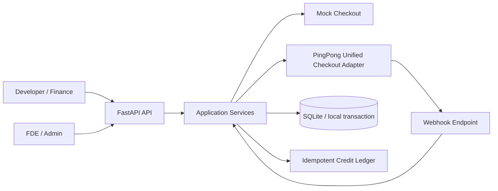
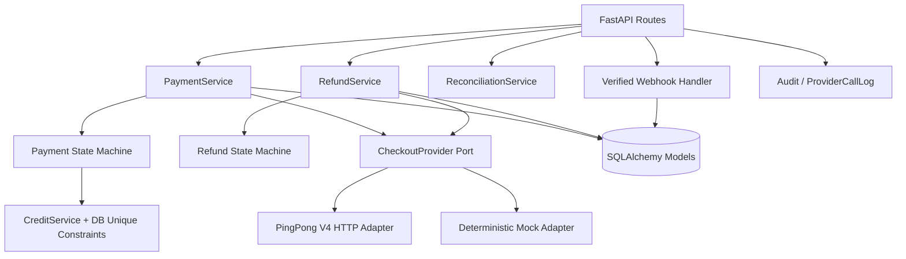
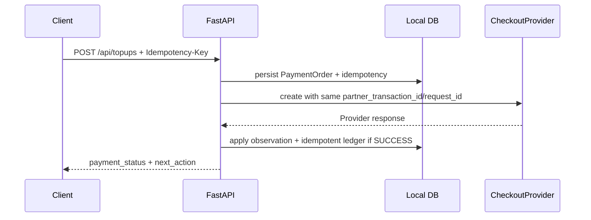
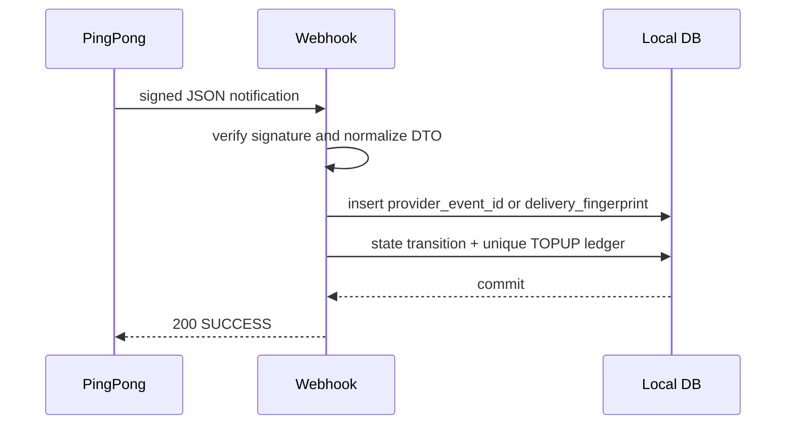
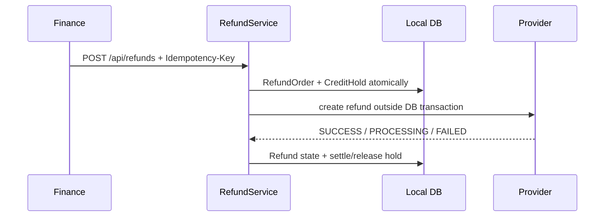
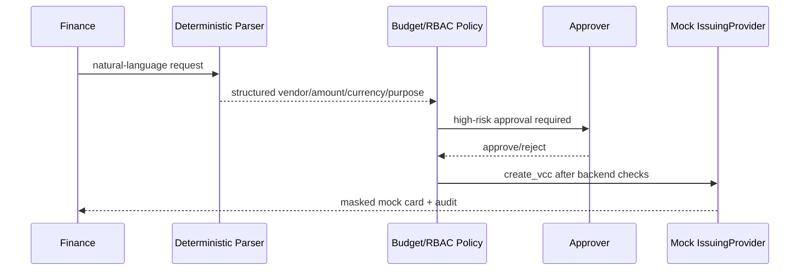

# Solution Design

> Change Risk: HIGH。本文描述的是可运行的 POC 边界，不是生产架构或真实 PingPong Sandbox 证明。

## Context Diagram



## Component Diagram



## 关键边界

- Provider DTO 位于 `app/integrations/pingpong/checkout_contracts.py`；Mapper 将官方 envelope 映射为 `ProviderPaymentResult` / `ProviderRefundResult`，业务服务不读取 `bizContent`、`resultCode` 等原始字段。
- HTTP Provider call 在本地 DB transaction 外。调用前先提交本地 Payment/RefundOrder 与幂等记录；返回后使用一个短事务写 Provider Observation、状态和 ledger。
- Webhook 先验签，再解析 allowlist、核对订单金额/币种，最后进入短事务。请求体只在内存中用于验签，不落日志或数据库。
- Payment success、Webhook success、Query success 共用 `PaymentService.apply_observation`；Credits 只由 `CreditService.add_topup` 入账。`CreditLedger` 的唯一约束是本地事务边界内防止重复业务效果的最后防线。
- Provider delivery 可能重复、乱序或不确定；本地 ledger 是 idempotent，不宣称端到端 distributed exactly-once。
- Create timeout 表示远端受理结果未知。POC 保持 `PROCESSING`，使用原有 `partner_transaction_id` / `provider_request_id` 查单，不盲目创建第二笔。
- Redirect/action 只代表客户下一步，不是支付终态；终态必须来自已认证 Create response、已验签 Webhook 或 Query/Reconciliation。

## Sequence 1：Create Payment



## Sequence 2：Webhook SUCCESS → Ledger



## Sequence 3：Create Timeout → Query Recovery

```mermaid
sequenceDiagram
    participant API as PaymentService
    participant PP as Provider
    participant DB as Local DB
    API->>PP: create(partner_transaction_id, request_id)
    PP--xAPI: network timeout
    API->>DB: keep PROCESSING; schedule reconcile
    API->>PP: query(same partner_transaction_id, same request_id)
    PP-->>API: SUCCESS
    API->>DB: state machine + idempotent ledger
```

## Sequence 4：Refund



## VCC Workflow（当前 P1 Mock）

Finance 是 Requester，只提交申请；Approver 通过独立权限执行批准/拒绝；审批通过后，Finance / Authorized Operator 才能完成最终 Human Confirmation。UI 的 Persona 切换只服务于演示，不能改变后端 Principal 或绕过 RBAC。



## Design Decisions

1. **Domain vs Provider Contract**：第三方字段与 Domain 状态分离，便于替换 Adapter，也避免把未确认字段扩散到业务层。
2. **Provider call 在 transaction 外**：网络调用不持有 DB lock；未知结果进入 Query/Reconciliation。
3. **Webhook 短事务**：验签和解析在请求边界完成，事务只保护去重、状态迁移、ledger 和处理结果。
4. **Ledger 幂等**：`TOPUP:{payment_id}` 和数据库唯一约束共同保护本地业务效果；Provider webhook 仍按 at-least-once/uncertain 处理。
5. **Retry Policy**：Query/Refund Query 可 bounded retry timeout；Create timeout 不自动 retry，429/明确可安全重试错误使用同一幂等标识，sleep 通过 `Sleeper` 注入。
6. **SQLite 限制**：本 POC 支持单实例演示；生产应使用 PostgreSQL row lock/更强并发策略并补充目标数据库测试。
