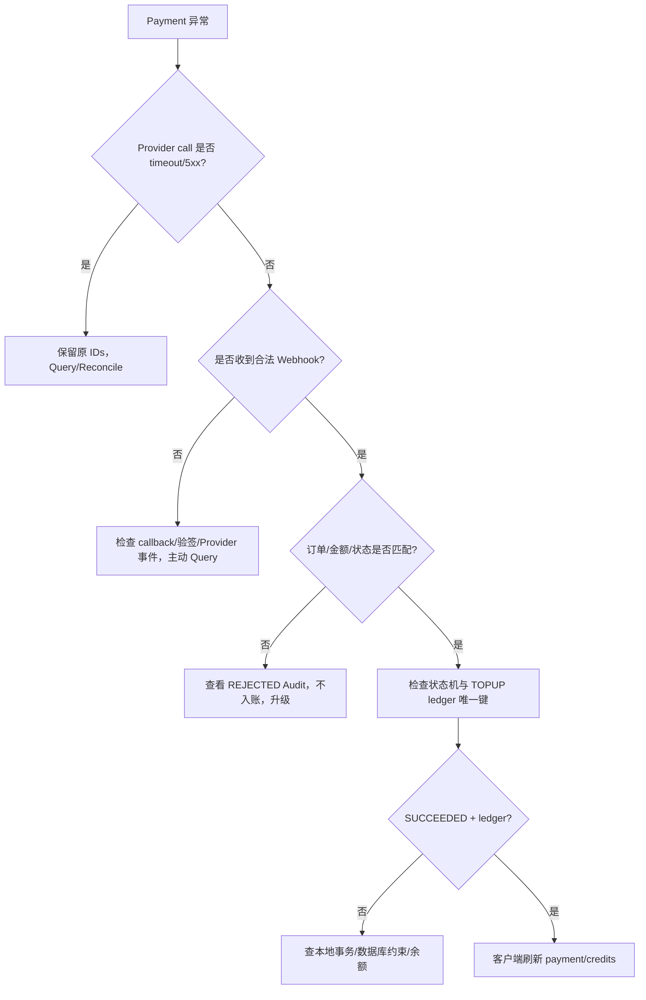

# Troubleshooting Guide

原则：先按 `trace_id`、`local_payment_id`、`request_id`、`partner_transaction_id`、`transaction_id` 关联证据；不要把前端 redirect 当成支付事实，也不要在未知结果时新建交易。

## Symptom → Diagnostic Path

所有案例先收集：发生时间（含 timezone）、客户环境、完整 `trace_id`、`local_payment_id`、`request_id`、`partner_transaction_id`、如有则 `transaction_id` / `refund_id`，以及去敏后的 HTTP status/provider code。不要提供 Authorization、salt、完整 token、PAN、CVV、原始 webhook 或支付 action URL。

## 1. Create Payment timeout

- 症状：API 返回 `PROCESSING` 或 `ProviderTimeout`，无法确认 Provider 是否受理。
- 需要客户提供：`trace_id`、`local_payment_id`、`request_id`、`partner_transaction_id`、发生时间。
- 检查点：ProviderCallLog 是否为 `timeout`；Payment 是否仍为 `PROCESSING`；是否错误生成第二个 order/request ID。
- 常见根因：网络连接、上游响应超时、callback 与同步响应竞态。
- 恢复动作：用同一 `partner_transaction_id + request_id` 调 Query/Reconciliation；不要盲目重新 Create。
- 升级条件：Query 无结果、Provider 与本地金额不一致、或出现疑似重复支付。

## 2. Payment 长时间 PROCESSING

- 症状：超过业务阈值没有终态。
- 需要客户提供：`local_payment_id`、`partner_transaction_id`、`transaction_id`、最后一次 `trace_id`。
- 检查点：`next_reconcile_at`、Provider Query 结果、Webhook Events 的 `REJECTED` 原因、callback 是否公网 HTTPS。
- 常见根因：通知丢失、支付方法仍处理中、账户 callback/权限配置不完整。
- 恢复动作：运行 `POST /api/admin/payments/{id}/reconcile` 或 `scripts/reconcile_due.py`；等待 Query 的可信结果。
- 升级条件：连续 bounded Query 仍无结果或 Provider 返回不在已知状态集合。

## 3. 客户声称支付成功但 Credits 未到账

- 症状：用户截图/redirect 成功，但本地余额未增加。
- 需要客户提供：`local_payment_id`、`partner_transaction_id`、`transaction_id`、支付时间；不要索要卡数据。
- 检查点：服务端是否收到并验签；Payment 是否 `SUCCEEDED`；是否存在 `TOPUP:{payment_id}`；是否被金额/币种 mismatch 拒绝。
- 常见根因：只依赖前端 redirect、Webhook 验签失败、通知未知订单、Query 尚未执行。
- 恢复动作：主动 Query；确认成功 Observation 经过 `PaymentService.apply_observation`；检查 ledger unique constraint。
- 升级条件：Provider 明确 SUCCESS 但本地状态/ledger transaction rollback。

## 4. Webhook 401 / signature failed

- 症状：callback 返回 401。
- 需要客户提供：时间、`trace_id`（若有）、Provider account/site，不提供签名值或原始 body。
- 检查点：Mock 是否使用 `X-Mock-Signature`；Sandbox 是否注入了账户级 `PingPongWebhookVerifier`，并保留原始 body 和 headers。
- 常见根因：未配置当前 webhook verifier、将旧版 body envelope verifier 用到 current flat webhook、把 Mock HMAC 用到 Sandbox。
- 恢复动作：保留 raw body 只在请求内存中核对；使用脱敏字段重现 contract test；修复配置后重放由 Provider 发起的通知。
- 升级条件：账户级验签材料或官方样例仍未确认，标记 Sandbox Pending，不猜算法。

## 5. 重复 Webhook

- 症状：同一支付收到多次 SUCCESS。
- 需要客户提供：`local_payment_id`、通知时间和 Provider transaction ID。
- 检查点：`provider_event_id` 是否官方明确提供；否则查看 `delivery_fingerprint`；TOPUP ledger 是否仅一条。
- 常见根因：Provider at-least-once delivery、网络重试、不同 JSON key 顺序。
- 恢复动作：返回成功 ACK；依靠 delivery fingerprint、单调状态机和 ledger unique constraint；不要删除审计事件。
- 升级条件：出现多条 ledger 或余额变化超过一次。

## 6. 429

- 症状：Provider 返回 HTTP 429。
- 需要客户提供：operation、`request_id`、`trace_id`、发生频率；不提供 token。
- 检查点：`Retry-After`、当前 attempt、Query/Create 类型、是否超过 max attempts。
- 常见根因：并发过高、无退避、把 Query 和 Create 使用同一激进策略。
- 恢复动作：bounded exponential backoff + jitter；Create 遇不确定结果先 Query；测试使用 `NoOpSleeper`，不真实等待。
- 升级条件：持续限流或账户 QPS/产品限制与文档不一致。

## 7. Provider 5xx

- 症状：ProviderUnavailable 或 server error。
- 需要客户提供：操作、UTC 时间、`request_id`、HTTP status、site。
- 检查点：Create 是否已发出；本地 Payment 是否 PROCESSING；Query 是否使用原 IDs。
- 常见根因：上游暂时不可用、网关错误、区域 endpoint 错误。
- 恢复动作：Query bounded retry；保留原幂等标识；必要时人工对账。
- 升级条件：Provider status page/官方支持确认异常，或 Query 与 webhook 不一致。

## 8. Refund PROCESSING

- 症状：退款已创建但未终态。
- 需要客户提供：`refund_id`、`partner_refund_id`、原 Payment IDs。
- 检查点：RefundOrder 状态、CreditHold 是否仍 `HELD`、Refund Query、Webhook 是否 `REFUND`。
- 常见根因：异步退款、通知丢失、Provider 需要延迟处理。
- 恢复动作：`POST /api/refunds/{refund_id}/query`，不要重复创建退款；hold 保持直到成功/失败。
- 升级条件：Provider 成功但 hold 未结算，或失败但 hold 未释放。

## 9. Idempotency conflict

- 症状：API 返回 409。
- 需要客户提供：route、principal、Idempotency-Key、两次请求的非敏感字段摘要。
- 检查点：同一 key 是否改变 amount/currency/payment_id；查看本地 ApiIdempotency 的 resource。
- 常见根因：客户端重用了 key 发送了不同业务请求。
- 恢复动作：原业务请求继续使用原 key；新业务生成新 key；不要改写已存在的记录。
- 升级条件：同一 payload 也无法 replay 或 resource 丢失。

## 10. 状态不一致

- 症状：Provider status 与本地 Domain status 不匹配。
- 需要客户提供：各 correlation IDs、Provider Query/notification 时间线。
- 检查点：是否存在乱序 PENDING/PROCESSING；本地终态是否回退；`provider_status` 是否被旧 observation 覆盖。
- 常见根因：Webhook handler 维护了第二套逻辑、直接写 status、未走统一 mapper/state machine。
- 恢复动作：重跑可信 Query，检查 `PaymentService.apply_observation` 和 Audit；终态不回退。
- 升级条件：出现非法 transition 或成功后余额变化。

## 11. 如何使用 `/ui/fde`

- 症状：需要快速判断 POC 当前证据链。
- 需要客户提供：无需敏感信息；输入 `Payment ID`、`Application ID` 或完整 `Trace ID` 即可。
- 检查点：页面会按 `API Request → Provider Call → Provider Response → Webhook → State Transition → Ledger / Audit` 展示安全关联元数据，并允许复制完整 Trace ID。
- 保护边界：原始 Provider Request/Response Body、签名 Header 和敏感字段不持久化；页面只展示 Provider Request ID、HTTP 结果、错误、Audit 和 latency。
- 常见误区：把 UI 的 Mock 操作当作 Sandbox E2E；把 `delivery_fingerprint` 当成 Provider event ID。
- 恢复动作：从 UI 复制 correlation IDs，再用 API Query；本地演示可使用 `scripts/reconcile_due.py`。
- 升级条件：UI 与数据库/API 展示不一致，或涉及真实账户。
